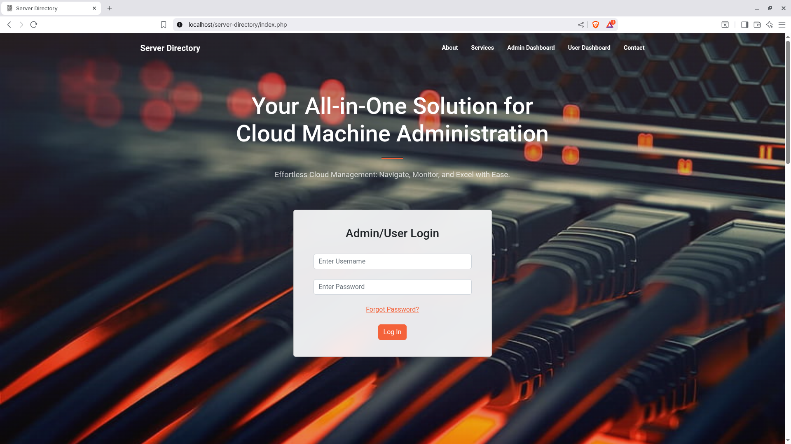

# Server-Directory

### Centralized Cloud Machine Management System

In today’s rapidly evolving cloud infrastructure, managing and monitoring numerous virtual machines distributed across different platforms can become complex.

The Centralized Cloud Machine Management System provides a single platform to store, monitor, and manage all virtual machines in an organization’s cloud infrastructure, ensuring better visibility, control, and efficiency.

---
### Objectives

- Build a user-friendly web interface for centralized machine management.

- Collect and store detailed information (OS, CPU, RAM, status, etc.) for each machine.

- Enable real-time updates on machine health and status.

- Implement secure authentication and role-based authorization.

---
### Technologies Used

Frontend: HTML, CSS, Bootstrap, JavaScript

Backend: PHP

Database: MySQL

Server: Apache

IDE: Visual Studio Code

---
### Features
- Dashboard Overview

Snapshot of the overall machine health and system status

Interactive charts and graphs for quick insights

- Machine Listing

Comprehensive list of machines with essential specifications

Search and filter options for easy navigation

- Machine Details

Dedicated page for each machine with in-depth details

Real-time updates on machine health

- Authentication & Authorization

Secure login system to restrict unauthorized access

Role-based permissions to manage system integrity

- Future Enhancements

Automation: Task scheduling and resource scaling

Alerts & Notifications: Trigger notifications for critical events and thresholds

Performance Metrics: Monitor and analyze system performance

API Integration: Seamlessly connect with other services and tools

---
### Conclusion

The Centralized Cloud Machine Management System simplifies monitoring and managing virtual machines by providing a central hub for infrastructure management.

This project establishes the foundation for future scalability and adaptability to evolving cloud environments. With continuous enhancements, it can become an indispensable tool for modern cloud-based organizations.

---
#### Website Preview:

 

 

